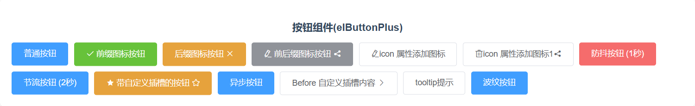

# ElButtonPlus 组件使用说明文档

## 一、简介
ElButtonPlus 是基于 Element UI 的 `el-button` 组件进行扩展的自定义按钮组件，它支持工具提示功能，同时具备异步点击处理、节流和防抖等特性，并且提供了多个插槽方便用户自定义按钮内容。

## 二、核心功能
1. **工具提示**：可为按钮添加工具提示，支持自定义提示内容、位置和样式效果。
2. **异步点击处理**：支持异步点击事件，点击按钮时可显示加载状态。
3. **节流和防抖**：可设置节流和防抖等待时间，避免频繁点击。
4. **多插槽支持**：提供多个插槽，如 `icon`、`loading`、`left-text` 等，方便自定义按钮内容。

## 三、完整使用示例
```vue
<template>
   <div class="el-btn">
      <!-- 普通按钮 -->
      <ElButtonPlus type="primary" @click="handleClick">普通按钮</ElButtonPlus>

      <!-- 带前缀图标的按钮 -->
      <ElButtonPlus type="success" prefixIcon="el-icon-check" @click="handleClick">
         前缀图标按钮
      </ElButtonPlus>

      <!-- 带后缀图标的按钮 -->
      <ElButtonPlus type="warning" suffixIcon="el-icon-close" @click="handleClick">
         后缀图标按钮
      </ElButtonPlus>

      <!-- 带前后缀图标的按钮 -->
      <ElButtonPlus type="info" prefixIcon="el-icon-edit" suffixIcon="el-icon-share" @click="handleClick">
         前后缀图标按钮
      </ElButtonPlus>
      <!-- 使用 icon 属性添加图标 -->
      <el-button-plus icon="edit">icon 属性添加图标</el-button-plus>
      <!-- 同时使用 prefixIcon 和 icon -->
      <el-button-plus icon="delete" suffix-icon="el-icon-share">icon 属性添加图标1</el-button-plus>
      <!-- 防抖按钮 -->
      <ElButtonPlus type="danger" :debounceWait="1000" @click="handleClick">
         防抖按钮 (1秒)
      </ElButtonPlus>

      <!-- 节流按钮 -->
      <ElButtonPlus type="primary" :throttleWait="2000" @click="handleClick">
         节流按钮 (2秒)
      </ElButtonPlus>
      <!-- 带自定义插槽的按钮 -->
      <ElButtonPlus type="warning" @click="handleClick">
         <template #prefixIcon>
            <i class="el-icon-star-on"></i>
         </template>
         带自定义插槽的按钮
         <template #suffixIcon>
            <i class="el-icon-star-off"></i>
         </template>
      </ElButtonPlus>
      <!--异步模拟-->
      <ElButtonPlus type="primary" async @async-click="handleAsyncClick">
         异步按钮
      </ElButtonPlus>
      <!-- 插槽 -->
      <ElButtonPlus>
         <!-- 使用原生 default 插槽 -->
         自定义插槽内容
         <!-- 使用新增的 left-text 插槽 -->
         <template #left-text>
            <span>Before </span>
         </template>
         <!-- 使用新增的 right-icon 插槽 -->
         <template #right-icon>
            <i class="el-icon-arrow-right"></i>
         </template>
      </ElButtonPlus>
      <!-- 基本提示 -->
      <el-button-plus
              tooltip-content="刷新数据"
              tooltip-placement="top"
      >
         <i class="el-icon-refresh" slot="icon" />
         tooltip提示
      </el-button-plus>
      <el-button-plus v-waves type="primary">波纹按钮</el-button-plus>
   </div>
</template>
<script>
   import ElButtonPlus from "@/components/button/elButtonPlus.vue";

   export default {
      name: "elButtonDemo",
      components: {ElButtonPlus},
      methods: {
         handleClick() {
            console.log("按钮被点击了");
         },
         handleAsyncClick({event, done}) {
            setTimeout(() => {
               done();
               console.log("异步按钮被点击了");
            }, 2000);
         }
      }
   }
</script>

<style scoped lang="less">
   /* 自定义主题样式 */
   .btn-theme-dark {
      background-color: #333 !important;
      color: #fff !important;
   }

   .btn-theme-dark:hover {
      background-color: #555 !important;
   }

   .el-btn {
      display: flex;
      flex-wrap: wrap;
      gap: 10px;
   }
</style>
```

## 四、props 属性说明及使用示例

### 1. 工具提示相关属性
- **`tooltipContent`**：工具提示内容，类型为 `String`，默认值为 `''`。
```vue
<ElButtonPlus tooltipContent="这是一个工具提示">带工具提示的按钮</ElButtonPlus>
```
- **`tooltipPlacement`**：提示框位置，类型为 `String`，默认值为 `'bottom'`，可选值为 `top`、`bottom`、`left`、`right`。
```vue
<ElButtonPlus tooltipContent="这是一个工具提示" tooltipPlacement="top">带工具提示的按钮</ElButtonPlus>
```
- **`tooltipEffect`**：提示框样式效果，类型为 `String`，默认值为 `'dark'`。
```vue
<ElButtonPlus tooltipContent="这是一个工具提示" tooltipEffect="light">带工具提示的按钮</ElButtonPlus>
```

### 2. 原有属性
- **`async`**：是否启用异步点击处理，类型为 `Boolean`，默认值为 `false`。
```vue
<ElButtonPlus async @async-click="handleAsyncClick">异步按钮</ElButtonPlus>
```
- **`prefixIcon`**：前缀图标类名，类型为 `String`。
```vue
<ElButtonPlus prefixIcon="el-icon-search">带前缀图标的按钮</ElButtonPlus>
```
- **`suffixIcon`**：后缀图标类名，类型为 `String`。
```vue
<ElButtonPlus suffixIcon="el-icon-arrow-right">带后缀图标的按钮</ElButtonPlus>
```
- **`throttleWait`**：节流等待时间(毫秒)，类型为 `Number`，默认值为 `0`。
```vue
<ElButtonPlus async :throttleWait="1000" @async-click="handleAsyncClick">节流异步按钮</ElButtonPlus>
```
- **`debounceWait`**：防抖等待时间(毫秒)，类型为 `Number`，默认值为 `0`。
```vue
<ElButtonPlus async :debounceWait="1000" @async-click="handleAsyncClick">防抖异步按钮</ElButtonPlus>
```
- **`icon`**：图标名称(带 `el-icon-` 前缀)，类型为 `String`。
```vue
<ElButtonPlus icon="edit">带图标的按钮</ElButtonPlus>
```

### props 属性表格
| 属性名         | 类型     | 属性说明                                                                             | 属性默认值 | 属性可选值                    | 属性示例           |
|--------------|--------|----------------------------------------------------------------------------------|--------|--------------------------|----------------|
| tooltipContent | String | 工具提示内容                                                                           | ''     | -                        | 这是一个工具提示       |
| tooltipPlacement | String | 提示框位置，可选值：top/bottom/left/right                                                     | bottom | top/bottom/left/right    | top            |
| tooltipEffect  | String | 提示框样式效果                                                                          | dark   | -                        | light          |
| async        | Boolean | 是否启用异步点击处理                                                                       | false  | -                        | true           |
| prefixIcon   | String | 前缀图标类名                                                                           | -      | -                        | el-icon-search |
| suffixIcon   | String | 后缀图标类名                                                                           | -      | -                        | el-icon-arrow-right |
| throttleWait | Number | 节流等待时间(毫秒)                                                                       | 0      | -                        | 1000           |
| debounceWait | Number | 防抖等待时间(毫秒)                                                                       | 0      | -                        | 1000           |
| icon         | String | 图标名称(带el-icon-前缀)                                                                  | -      | -                        | edit           |

## 五、emit 方法说明及使用示例

### 1. `click`
- **说明**：普通点击事件，当 `async` 属性为 `false` 时触发。
```vue
<ElButtonPlus @click="handleClick">普通按钮</ElButtonPlus>
```
```javascript
methods: {
  handleClick() {
    console.log('普通按钮被点击');
  }
}
```

### 2. `async-click`
- **说明**：异步点击事件，当 `async` 属性为 `true` 时触发。
```vue
<ElButtonPlus async @async-click="handleAsyncClick">异步按钮</ElButtonPlus>
```
```javascript
methods: {
  handleAsyncClick({ event, done }) {
    console.log('异步按钮被点击');
    // 模拟异步操作
    setTimeout(() => {
      done(); // 结束加载状态
    }, 2000);
  }
}
```

### 方法属性表格
| 方法名         | 方法说明                             | 方法参数                                 | 参数示例                                                |
|-------------|----------------------------------|--------------------------------------|-----------------------------------------------------|
| click       | 普通点击事件，当 `async` 属性为 `false` 时触发 | e: 点击事件对象                            | 无                                                   |
| async-click | 异步点击事件，当 `async` 属性为 `true` 时触发  | "{ event: 点击事件对象, done: 结束加载状态的回调函数 }" | "{ event: event, done: () => console.log('加载状态结束') }" |

## 六、最终效果
- 带工具提示的按钮：鼠标悬停在按钮上时会显示工具提示信息。
- 异步按钮：点击按钮时会显示加载状态，异步操作完成后加载状态消失。
- 节流和防抖按钮：可有效避免频繁点击，提高性能。

## 七、常见问题及解决办法

### 1. 工具提示不显示
- **问题原因**：可能是 `tooltipContent` 属性未正确设置或样式冲突。
- **解决办法**：检查 `tooltipContent` 属性是否有值，确保样式没有影响工具提示的显示。

### 2. 异步按钮加载状态不消失
- **问题原因**：可能是 `async-click` 事件中的 `done` 回调函数未正确调用。
- **解决办法**：确保在异步操作完成后调用 `done` 回调函数。

### 3. 节流和防抖功能无效
- **问题原因**：可能是 `throttleWait` 或 `debounceWait` 属性设置不正确。
- **解决办法**：检查 `throttleWait` 和 `debounceWait` 属性的值是否大于 0。