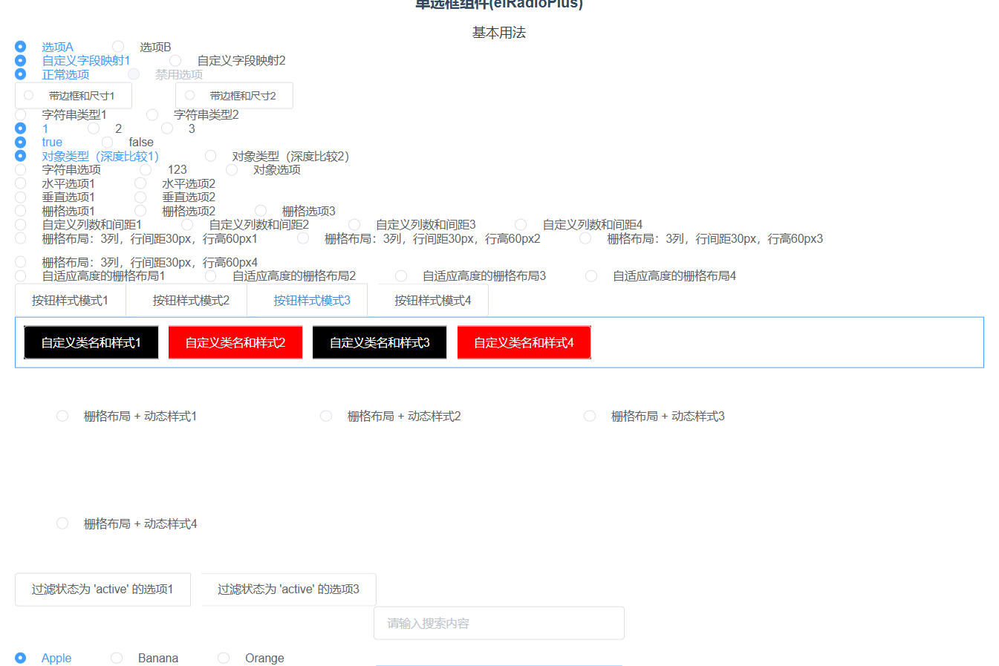
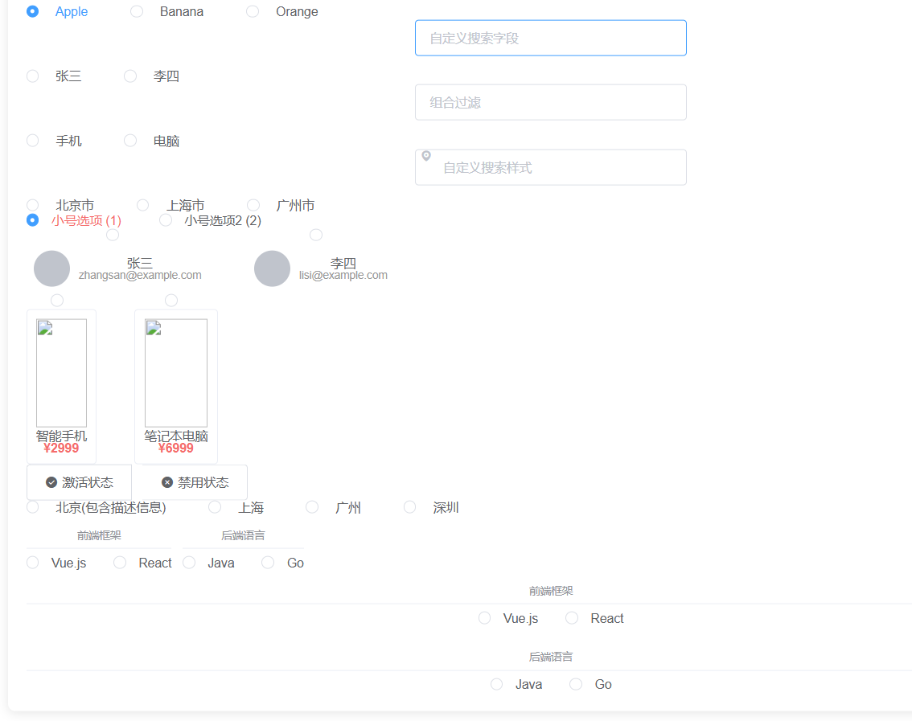

# ElRadioPlus增强型单选框组件使用说明文档

## 简介
ElRadioPlus是一款增强型的单选框组件，旨在为开发者提供更灵活、强大的单选框功能。它支持动态选项配置，可处理多种数据类型，并且具备分组展示、搜索过滤、自定义样式等丰富特性，能满足各类复杂业务场景的需求。

## 核心功能
1. **动态选项配置**：支持多种数据类型，如字符串、数字、对象等作为选项。
2. **分组模式**：允许将选项按组进行分类展示，提高选项的组织性。
3. **搜索功能**：集成搜索框，支持模糊匹配，方便用户快速定位选项。
4. **自定义样式**：可对容器和选项的样式进行自定义，包括类名和内联样式。

## 完整使用示例
```html
<template>
    <div>
        基本用法
        <el-radio-plus
                v-model="value1"
                :options="[
        { label: '选项A', value: 1 },
        { label: '选项B', value: 2 }
      ]"
        />

        <!-- 自定义字段映射 -->
        <el-radio-plus
                v-model="value3"
                :options="[
        { name: '自定义字段映射1', id: 'male' },
        { name: '自定义字段映射2', id: 'female' }
      ]"
                :field-names="{
        label: 'name',
        value: 'id'
      }"
        />

        <!-- 禁用状态 -->
        <el-radio-plus
                v-model="value4"
                :options="[
        { label: '正常选项', value: 1 },
        { label: '禁用选项', value: 2, disabled: true }
      ]"
        />

        <!-- 带边框和尺寸 -->
        <el-radio-plus
                v-model="value5"
                :options="['带边框和尺寸1', '带边框和尺寸2']"
                border
                size="small"
        />
        <!-- 字符串类型 -->
        <el-radio-plus
                v-model="strValue"
                :options="['字符串类型1', '字符串类型2']"
        />

        <!-- 数字类型 -->
        <el-radio-plus
                v-model="numValue"
                :options="[1, 2, 3]"
        />

        <!-- 布尔类型 -->
        <el-radio-plus
                v-model="boolValue"
                :options="[true, false]"
        />
        <!-- 对象类型（深度比较） -->
        <el-radio-plus
                v-model="deepObjValue"
                :options="[
        { label: '对象类型（深度比较1）', value: { id: 1 } },
        { label: '对象类型（深度比较2）', value: { id: 2 } }
      ]"
                :deep-compare="true"
        />

        <!-- 混合数据类型 -->
        <el-radio-plus
                v-model="mixedValue"
                :options="[
        '字符串选项',
        123,
        { label: '对象选项', value: { id: 1 } }
      ]"
                :deep-compare="true"
        />
        <!-- 水平排列 -->
        <el-radio-plus
                v-model="selected"
                :options="['水平选项1', '水平选项2']"
                layout-type="inline"
        />

        <!-- 垂直排列 -->
        <el-radio-plus
                v-model="selected"
                :options="['垂直选项1', '垂直选项2']"
                layout-type="block"
        />

        <!-- 3列栅格布局 -->
        <el-radio-plus
                v-model="selected"
                :options="['栅格选项1', '栅格选项2', '栅格选项3']"
                layout-type="grid"
                :columns="3"
                :gutter="20"
        />

        <!-- 自定义列数和间距 -->
        <el-radio-plus
                v-model="selected"
                :options="['自定义列数和间距1', '自定义列数和间距2', '自定义列数和间距3', '自定义列数和间距4']"
                layout-type="grid"
                :columns="2"
                :gutter="50"
        />
        <!-- 栅格布局：3列，行间距30px，行高60px -->
        <el-radio-plus
                v-model="selected"
                :options="['栅格布局：3列，行间距30px，行高60px1', '栅格布局：3列，行间距30px，行高60px2', '栅格布局：3列，行间距30px，行高60px3', '栅格布局：3列，行间距30px，行高60px4']"
                layout-type="grid"
                :columns="3"
                :row-spacing="30"
                :row-height="60"
        />
        <!-- 自适应高度的栅格布局 -->
        <el-radio-plus
                v-model="selected"
                :options="['自适应高度的栅格布局1', '自适应高度的栅格布局2', '自适应高度的栅格布局3', '自适应高度的栅格布局4']"
                layout-type="grid"
                :columns="2"
                :row-spacing="15"
                row-height="auto"
        />
        <!-- 按钮样式模式 -->
        <el-radio-plus
                v-model="selected"
                :options="['按钮样式模式1', '按钮样式模式2', '按钮样式模式3', '按钮样式模式4']"
                button-style
                border
                size="medium"
        />
        <!-- 自定义类名和样式 -->
        <el-radio-plus
                v-model="selected"
                :options="['自定义类名和样式1', '自定义类名和样式2', '自定义类名和样式3', '自定义类名和样式4']"
                button-style
                :container-class="{ 'custom-container': true }"
                :item-class="getItemClass"
                :item-style="getItemStyle"
                :events="['click', 'blur']"
                @click="handleItemClick"
                @blur="handleItemBlur"
        />

        <!-- 栅格布局 + 动态样式 -->
        <el-radio-plus
                v-model="selectedGrid"
                :options="['栅格布局 + 动态样式1', '栅格布局 + 动态样式2', '栅格布局 + 动态样式3', '栅格布局 + 动态样式4']"
                layout-type="grid"
                :columns="3"
                :row-spacing="20"
                :item-style="{ padding: '50px' }"
        />
        <!-- 示例1：使用过滤函数 -->
        <el-radio-plus
                v-model="selected"
                :options="[
        { label: '过滤状态为 \'active\' 的选项1', value: 'a', name: 'Alpha', status: 'active' },
        { label: '过滤状态为 \'active\' 的选项2', value: 'b', name: 'Beta', status: 'inactive' },
        { label: '过滤状态为 \'active\' 的选项3', value: 'c', name: 'Gamma', status: 'active' }
      ]"
                :filter="onlyActiveOptions"
                button-style
        />
        <!-- 基础搜索 -->
        <el-radio-plus
                v-model="value1"
                :options="fruitOptions"
                show-search
        />

        <!-- 自定义搜索字段 -->
        <el-radio-plus
                v-model="value2"
                :options="userOptions"
                show-search
                filter-key="label"
                search-placeholder="自定义搜索字段"
        />

        <!-- 组合过滤 -->
        <el-radio-plus
                v-model="value3"
                :options="productOptions"
                show-search
                :filter="stockFilter"
                search-placeholder="组合过滤"
        />

        <!-- 自定义搜索样式 -->
        <el-radio-plus
                v-model="value4"
                :options="cityOptions"
                show-search
                search-prefix="el-icon-location"
                search-placeholder="自定义搜索样式"
                fuzzy-mode="start"
        />
        <!-- 默认插槽用法 -->
        <el-radio-plus v-model="value1" :options="options">
            <template #default="{ item, checked }">
        <span :class="{ 'text-red': checked }">
          {{ item.label }} ({{ item.value }})
        </span>
            </template>
        </el-radio-plus>

        <!-- 具名插槽用法 -->
        <el-radio-plus v-model="value2" :options="users">
            <template #option="{ item, index }">
                <div class="user-option">
                    <el-avatar :src="item.avatar"></el-avatar>
                    <div class="user-info">
                        <div>{{ item.label }}</div>
                        <div class="email">{{ item.email }}</div>
                    </div>
                </div>
            </template>
        </el-radio-plus>

        <!-- 组合布局和插槽 -->
        <el-radio-plus
                v-model="value3"
                :options="products"
                layout-type="grid"
                :columns="4"
        >
            <template #option="{ item, checked }">
                <div :class="['product-card', { active: checked }]">
                    
                    <div class="product-name">{{ item.name }}</div>
                    <div class="product-price">¥{{ item.price }}</div>
                </div>
            </template>
        </el-radio-plus>

        <!-- 按钮样式插槽 -->
        <el-radio-plus
                v-model="value4"
                :options="statusOptions"
                button-style
        >
            <template #option="{ item, checked }">
                <i :class="item.icon"></i>
                <span>{{ item.label }}</span>
                <el-tag v-if="checked" size="mini">当前状态</el-tag>
            </template>
        </el-radio-plus>
        <el-radio-plus
                v-model="selectedValue"
                :options="optionList"
                tooltip-placement="left"
                tooltip-effect="dark"
        />
        <el-radio-plus
                :is-grouped="true"
                :options="[
    {
      label: '前端框架',
      options: [
        { value: 'vue', label: 'Vue.js' },
        { value: 'react', label: 'React' }
      ]
    },
    {
      label: '后端语言',
      options: [
        { value: 'java', label: 'Java' },
        { value: 'go', label: 'Go' }
      ]
    }
  ]"
                :group-field-names="{ label: 'label', options: 'options' }"
        />
        <el-radio-plus
                layout-direction="vertical"
                :is-grouped="true"
                :options="[
    {
      label: '前端框架',
      options: [
        { value: 'vue', label: 'Vue.js' },
        { value: 'react', label: 'React' }
      ]
    },
    {
      label: '后端语言',
      options: [
        { value: 'java', label: 'Java' },
        { value: 'go', label: 'Go' }
      ]
    }
  ]"
                :group-field-names="{ label: 'label', options: 'options' }"
        />
    </div>
</template>

<script>
    import ElRadioPlus from "@/components/radio/elRadioPlus.vue";

    export default {
        components: {ElRadioPlus},
        data() {
            return {
                selectedValue: null,
                optionList: [
                    {
                        label: '北京(包含描述信息)',
                        value: 'a',
                        description: '中国的首都，政治文化中心'
                    },
                    {
                        label: '上海',
                        value: 'b',
                    },
                    {
                        label: '广州',
                        value: 'c',
                    },
                    {
                        label: '深圳',
                        value: 'd',
                    }
                ],
                users: [
                    {
                        value: 1,
                        label: '张三',
                        email: 'zhangsan@example.com',
                        avatar: 'https://example.com/avatar1.jpg'
                    },
                    {
                        value: 2,
                        label: '李四',
                        email: 'lisi@example.com',
                        avatar: 'https://example.com/avatar2.jpg'
                    }
                ],
                products: [
                    {
                        id: 1,
                        name: '智能手机',
                        price: 2999,
                        image: 'https://example.com/phone.jpg'
                    },
                    {
                        id: 2,
                        name: '笔记本电脑',
                        price: 6999,
                        image: 'https://example.com/laptop.jpg'
                    }
                ],
                statusOptions: [
                    {
                        label: '激活状态',
                        value: 'active',
                        icon: 'el-icon-success'
                    },
                    {
                        label: '禁用状态',
                        value: 'disabled',
                        icon: 'el-icon-error'
                    }
                ],
                fruitOptions: [
                    { label: 'Apple', value: 1 },
                    { label: 'Banana', value: 2 },
                    { label: 'Orange', value: 3 }
                ],
                userOptions: [
                    { value: 1, label: '张三', email: 'zhangsan@example.com' },
                    { value: 2, label: '李四', email: 'lisi@example.com' }
                ],
                productOptions: [
                    { value: 1, label: '手机', stock: 10 },
                    { value: 2, label: '电脑', stock: 5 },
                    { value: 3, label: '平板', stock: 0 }
                ],
                cityOptions: [
                    { label: '北京市', value: '110000' },
                    { label: '上海市', value: '310000' },
                    { label: '广州市', value: '440100' }
                ],
                selectedSearch: null,
                searchText: '',
                selectedGrid: null,
                selected: null,
                strValue: '苹果',
                numValue: 1,
                boolValue: true,
                objValue: { id: 1 }, // 必须与选项中的对象引用一致
                deepObjValue: { id: 1 }, // 可以传入结构相同的不同对象
                mixedValue: null,
                value1: 1,
                value2: '苹果',
                value3: 'male',
                value4: 1,
                value5: '',
                options: [
                    { label: '小号选项', value: 1 },
                    { label: '小号选项2', value: 2 }
                ]
            }
        },
        methods: {
            stockFilter(item) {
                return item.stock > 0
            },
            /**
             * 过滤状态为 'active' 的选项
             * @param {Object} item 当前选项
             * @returns {Boolean} 是否保留
             */
            onlyActiveOptions(item) {
                return item.status === 'active';
            },
            handleChange(val) {
                console.log('当前值:', val)
            },
            /**
             * 动态类名示例：为奇数项添加类名
             * @param {Object} item 当前选项
             * @param {Number} index 索引
             */
            getItemClass(item, index) {
                return index % 2 === 0 ? 'even-item' : 'odd-item';
            },

            /**
             * 动态样式示例：根据选项颜色设置背景
             * @param {Object} item 当前选项
             */
            getItemStyle(item) {
                return {
                    backgroundColor: item.color || 'transparent'
                };
            },

            /**
             * 处理点击事件
             * @param {Object} payload 事件数据
             */
            handleItemClick(payload) {
                console.log('Clicked item:', payload.item);
            },

            /**
             * 处理失焦事件
             * @param {Object} payload 事件数据
             */
            handleItemBlur(payload) {
                console.log('Blurred item:', payload.item);
            }
        }
    }
</script>
<style scoped lang="less">
    .search-container {
        margin-bottom: 20px;
    }
    /deep/ .custom-container {
        border: 1px solid #409eff;
        padding: 10px;
    }

    /deep/ .even-item {
        background-color: black !important;
        .el-radio-button__inner {
            background: none !important;
            color: white !important;
        }
    }

    /deep/ .odd-item {
        background-color: red !important;
        color: white !important;
        .el-radio-button__inner {
            color: white!important;
            background: none !important;
        }
    }
    .user-option {
        display: flex;
        align-items: center;
        padding: 8px;

        .user-info {
            margin-left: 10px;

            .email {
                font-size: 12px;
                color: #999;
            }
        }
    }

    .product-card {
        border: 1px solid #ebeef5;
        border-radius: 4px;
        padding: 10px;
        text-align: center;
        transition: all 0.3s;

        &.active {
            border-color: #409eff;
            background-color: #f5f7fa;
        }

        .product-image {
            width: 100%;
            height: 120px;
            object-fit: contain;
        }

        .product-price {
            color: #f56c6c;
            font-weight: bold;
        }
    }

    .text-red {
        color: #f56c6c;
    }
</style>
```

## props属性说明及使用示例
### layoutDirection
- **类型**：`String`
- **说明**：设置单选框的排列方向，有 `horizontal`（横向）和 `vertical`（纵向）两种值。
- **默认值**：`'horizontal'`
- **可选值**：`'horizontal'`, `'vertical'`
- **使用示例**：
```html
<el-radio-plus :layoutDirection=" 'vertical' " />
```

### isGrouped
- **类型**：`Boolean`
- **说明**：是否启用分组模式。
- **默认值**：`false`
- **可选值**：`true`, `false`
- **使用示例**：
```html
<el-radio-plus :isGrouped="true" />
```

### groupFieldNames
- **类型**：`Object`
- **说明**：分组字段映射配置，用于指定分组数据中标签和选项的字段名。
- **默认值**：`{ label: 'label', options: 'options' }`
- **使用示例**：
```html
<el-radio-plus :groupFieldNames="{ label: 'groupName', options: 'children' }" />
```

### tooltipPlacement
- **类型**：`String`
- **说明**：选项描述信息（tooltip）的显示位置。
- **默认值**：`'top'`
- **可选值**：`'top'`, `'bottom'`, `'left'`, `'right'`
- **使用示例**：
```html
<el-radio-plus :tooltipPlacement=" 'bottom' " />
```

### tooltipEffect
- **类型**：`String`
- **说明**：是否启用tooltip动画效果。
- **默认值**：`'dark'`
- **可选值**：`'light'`, `'dark'`
- **使用示例**：
```html
<el-radio-plus :tooltipEffect=" 'light' " />
```

### showSearch
- **类型**：`Boolean`
- **说明**：是否显示搜索框。
- **默认值**：`false`
- **可选值**：`true`, `false`
- **使用示例**：
```html
<el-radio-plus :showSearch="true" />
```

### searchPlaceholder
- **类型**：`String`
- **说明**：搜索框的占位符文本。
- **默认值**：`'请输入搜索内容'`
- **使用示例**：
```html
<el-radio-plus :searchPlaceholder=" '搜索单选框' " />
```

### searchClearable
- **类型**：`Boolean`
- **说明**：搜索框是否可清空。
- **默认值**：`true`
- **可选值**：`true`, `false`
- **使用示例**：
```html
<el-radio-plus :searchClearable="false" />
```

### searchPrefix
- **类型**：`String`
- **说明**：搜索框前缀图标。
- **默认值**：`''`
- **使用示例**：
```html
<el-radio-plus :searchPrefix=" 'el-icon-search' " />
```

### fuzzyMode
- **类型**：`String`
- **说明**：模糊匹配模式，有 `contains`（包含）、`start`（开头匹配）、`end`（结尾匹配）三种。
- **默认值**：`'contains'`
- **可选值**：`'contains'`, `'start'`, `'end'`
- **使用示例**：
```html
<el-radio-plus :fuzzyMode=" 'start' " />
```

### filter
- **类型**：`Function`
- **说明**：自定义过滤函数，用于对选项进行过滤。
- **默认值**：`null`
- **使用示例**：
```html
<el-radio-plus :filter="item => item.status === 'active'" />
```

### filterKey
- **类型**：`String`
- **说明**：指定选项中用于过滤的字段名（需配合 `searchTerm` 使用）。
- **默认值**：`''`
- **使用示例**：
```html
<el-radio-plus :filterKey=" 'name' " />
```

### searchTerm
- **类型**：`String`
- **说明**：搜索词（需配合 `filterKey` 使用）。
- **默认值**：`''`
- **使用示例**：
```html
<el-radio-plus :searchTerm=" 'keyword' " />
```

### containerClass
- **类型**：`String|Object|Array`
- **说明**：自定义容器的CSS类名。
- **默认值**：`''`
- **使用示例**：
```html
<el-radio-plus :containerClass=" 'custom - container' " />
```

### containerStyle
- **类型**：`Object`
- **说明**：自定义容器的内联样式。
- **默认值**：`{ display: 'flex', flexDirection: 'this.layoutDirection === \'vertical\'? \'column\' : \'row\', flexWrap: 'wrap', gap: '12px' }`
- **使用示例**：
```html
<el-radio-plus :containerStyle="{ backgroundColor: 'lightgray' }" />
```

### itemClass
- **类型**：`String|Function|Object|Array`
- **说明**：自定义选项的CSS类名（支持函数式返回）。
- **默认值**：`''`
- **使用示例**：
```html
<el-radio-plus :itemClass="(item, index) => `item - ${index}`" />
```

### itemStyle
- **类型**：`Object|Function`
- **说明**：自定义选项的内联样式（支持函数式返回）。
- **默认值**：`{}`
- **使用示例**：
```html
<el-radio-plus :itemStyle="(item) => ({ color: item.color })" />
```

### events
- **类型**：`Array`
- **说明**：需要监听的事件列表。
- **默认值**：`['change']`
- **使用示例**：
```html
<el-radio-plus :events="['click', 'blur']" />
```

### buttonStyle
- **类型**：`Boolean`
- **说明**：是否启用按钮样式模式，启用后显示为按钮式单选框（类似 `el - radio - button`）。
- **默认值**：`false`
- **可选值**：`true`, `false`
- **使用示例**：
```html
<el-radio-plus :buttonStyle="true" />
```

### layoutType
- **类型**：`String`
- **说明**：布局方式，有 `inline`（水平排列）、`block`（垂直排列）、`grid`（栅格布局）三种。
- **默认值**：`'inline'`
- **可选值**：`'inline'`, `'block'`, `'grid'`
- **使用示例**：
```html
<el-radio-plus :layoutType=" 'grid' " />
```

### columns
- **类型**：`Number`
- **说明**：栅格布局列数（仅 `layoutType='grid'` 时生效）。
- **默认值**：`3`
- **使用示例**：
```html
<el-radio-plus :columns="4" />
```

### gutter
- **类型**：`Number`
- **说明**：栅格列间距（仅 `layoutType='grid'` 时生效）。
- **默认值**：`20`
- **使用示例**：
```html
<el-radio-plus :gutter="30" />
```

### rowSpacing
- **类型**：`Number`
- **说明**：栅格行间距（仅 `layoutType='grid'` 时生效）。
- **默认值**：`20`
- **使用示例**：
```html
<el-radio-plus :rowSpacing="25" />
```

### rowHeight
- **类型**：`Number|String`
- **说明**：栅格项固定高度（仅 `layoutType='grid'` 时生效），设置为 `'auto'` 时自动适应内容。
- **默认值**：`'auto'`
- **使用示例**：
```html
<el-radio-plus :rowHeight="50" />
```

### value
- **类型**：`null`
- **说明**：组件值，支持任意数据类型。
- **默认值**：`null`
- **使用示例**：
```html
<el-radio-plus v-model="selectedValue" />
```

### options
- **类型**：`Array`
- **说明**：选项配置数组，支持混合类型。
- **默认值**：`无`（必填）
- **使用示例**：
```html
<el-radio-plus :options="['选项1', '选项2', { label: '选项3', value: 'option3' }]" />
```

### fieldNames
- **类型**：`Object`
- **说明**：字段映射配置，用于指定选项数据中标签和值的字段名。
- **默认值**：`{ label: 'label', value: 'value' }`
- **使用示例**：
```html
<el-radio-plus :fieldNames="{ label: 'name', value: 'id' }" />
```

### disabled
- **类型**：`Boolean`
- **说明**：是否禁用所有选项。
- **默认值**：`false`
- **可选值**：`true`, `false`
- **使用示例**：
```html
<el-radio-plus :disabled="true" />
```

### border
- **类型**：`Boolean`
- **说明**：是否显示边框。
- **默认值**：`false`
- **可选值**：`true`, `false`
- **使用示例**：
```html
<el-radio-plus :border="true" />
```

### size
- **类型**：`String`
- **说明**：尺寸，有 `medium`、`small`、`mini` 三种。
- **默认值**：`无`
- **可选值**：`'medium'`, `'small'`, `'mini'`
- **使用示例**：
```html
<el-radio-plus :size=" 'small' " />
```

### deepCompare
- **类型**：`Boolean`
- **说明**：当选项值为对象时，使用 `JSON.stringify` 进行深度对象比较。
- **默认值**：`false`
- **可选值**：`true`, `false`
- **使用示例**：
```html
<el-radio-plus :deepCompare="true" />
```

### props属性表格
|属性名|类型|属性说明|属性默认值|属性可选值|属性示例|
|---|---|---|---|---|---|
|layoutDirection|`String`|设置单选框排列方向|`'horizontal'`|`'horizontal'`, `'vertical'`|`'vertical'`|
|isGrouped|`Boolean`|是否启用分组模式|`false`|`true`, `false`|`true`|
|groupFieldNames|`Object`|分组字段映射配置|`{ label: 'label', options: 'options' }`|无|`{ label: 'groupName', options: 'children' }`|
|tooltipPlacement|`String`|选项描述信息显示位置|`'top'`|`'top'`, `'bottom'`, `'left'`, `'right'`|`'bottom'`|
|tooltipEffect|`String`|是否启用tooltip动画效果|`'dark'`|`'light'`, `'dark'`|`'light'`|
|showSearch|`Boolean`|是否显示搜索框|`false`|`true`, `false`|`true`|
|searchPlaceholder|`String`|搜索框占位符文本|`'请输入搜索内容'`|无|`'搜索单选框'`|
|searchClearable|`Boolean`|搜索框是否可清空|`true`|`true`, `false`|`false`|
|searchPrefix|`String`|搜索框前缀图标|`''`|无|`'el-icon-search'`|
|fuzzyMode|`String`|模糊匹配模式|`'contains'`|`'contains'`, `'start'`, `'end'`|`'start'`|
|filter|`Function`|自定义过滤函数|`null`|无|`item => item.status === 'active'`|
|filterKey|`String`|指定过滤字段名|`''`|无|`'name'`|
|searchTerm|`String`|搜索词|`''`|无|`'keyword'`|
|containerClass|`String|Object|Array`|自定义容器CSS类名|`''`|无|`'custom - container'`|
|containerStyle|`Object`|自定义容器内联样式|`{ display: 'flex', flexDirection: 'this.layoutDirection === \'vertical\'? \'column\' : \'row\', flexWrap: 'wrap', gap: '12px' }`|无|`{ backgroundColor: 'lightgray' }`|
|itemClass|`String|Function|Object|Array`|自定义选项CSS类名|`''`|无|`(item, index) => `item - ${index}``|
|itemStyle|`Object|Function`|自定义选项内联样式|`{}`|无|`(item) => ({ color: item.color })`|
|events|`Array`|需要监听的事件列表|`['change']`|无|`['click', 'blur']`|
|buttonStyle|`Boolean`|是否启用按钮样式模式|`false`|`true`, `false`|`true`|
|layoutType|`String`|布局方式|`'inline'`|`'inline'`, `'block'`, `'grid'`|`'grid'`|
|columns|`Number`|栅格布局列数|`3`|无|`4`|
|gutter|`Number`|栅格列间距|`20`|无|`30`|
|rowSpacing|`Number`|栅格行间距|`20`|无|`25`|
|rowHeight|`Number|String`|栅格项固定高度|`'auto'`|无|`50`|
|value|`null`|组件值|`null`|无|无|
|options|`Array`|选项配置数组|无（必填）|无|`['选项1', '选项2', { label: '选项3', value: 'option3' }]`|
|fieldNames|`Object`|字段映射配置|`{ label: 'label', value: 'value' }`|无|`{ label: 'name', value: 'id' }`|
|disabled|`Boolean`|是否禁用所有选项|`false`|`true`, `false`|`true`|
|border|`Boolean`|是否显示边框|`false`|`true`, `false`|`true`|
|size|`String`|尺寸|无|`'medium'`, `'small'`, `'mini'`|`'small'`|
|deepCompare|`Boolean`|是否深度比较对象选项值|`false`|`true`, `false`|`true`|

## emit方法说明及使用示例
- ### search
- **方法说明**：搜索词改变时触发的事件。
- **方法参数**：`value` - 当前搜索词。
- **参数示例**：
```html
<el - radio - plus @search="handleSearchChange" />
```
```javascript
methods: {
    handleSearchChange(value) {
        console.log('搜索词改变为:', value);
    }
}
```

### click（当`events`数组包含`click`时触发）
- **方法说明**：当选项被点击且`events`数组包含`click`时触发的事件。
- **方法参数**：一个对象，包含`value`（选项值）、`item`（选项数据）、`event`（原生事件对象）。
- **参数示例**：
```html
<el - radio - plus :events="['click']" @click="handleClick" />
```
```javascript
methods: {
    handleClick(payload) {
        console.log('点击选项值:', payload.value);
        console.log('点击选项数据:', payload.item);
        console.log('原生事件对象:', payload.event);
    }
}
```

### blur（当`events`数组包含`blur`时触发）
- **方法说明**：当选项失去焦点且`events`数组包含`blur`时触发的事件。
- **方法参数**：一个对象，包含`value`（选项值）、`item`（选项数据）、`event`（原生事件对象）。
- **参数示例**：
```html
<el - radio - plus :events="['blur']" @blur="handleBlur" />
```
```javascript
methods: {
    handleBlur(payload) {
        console.log('选项失去焦点，选项值:', payload.value);
        console.log('选项失去焦点，选项数据:', payload.item);
        console.log('原生事件对象:', payload.event);
    }
}
```

### change（当`events`数组包含`change`时触发）
- **方法说明**：当选项值改变且`events`数组包含`change`时触发的事件。
- **方法参数**：一个对象，包含`value`（选项值）、`item`（选项数据）、`event`（原生事件对象）。
- **参数示例**：
```html
<el - radio - plus :events="['change']" @change="handleChange" />
```
```javascript
methods: {
    handleChange(payload) {
        console.log('选项值改变为:', payload.value);
        console.log('改变的选项数据:', payload.item);
        console.log('原生事件对象:', payload.event);
    }
}
```

### emit方法属性表格
|方法名|方法说明|方法参数|参数示例|
|---|---|---|---|
|search|搜索词改变时触发的事件|`value` - 当前搜索词|`@search="handleSearchChange"`，`handleSearchChange(value) { console.log('搜索词改变为:', value); }`|
|click（当`events`数组包含`click`时触发）|选项被点击时触发的事件|一个对象，包含`value`（选项值）、`item`（选项数据）、`event`（原生事件对象）|`@click="handleClick"`，`handleClick(payload) { console.log('点击选项值:', payload.value); console.log('点击选项数据:', payload.item); console.log('原生事件对象:', payload.event); }`|
|blur（当`events`数组包含`blur`时触发）|选项失去焦点时触发的事件|一个对象，包含`value`（选项值）、`item`（选项数据）、`event`（原生事件对象）|`@blur="handleBlur"`，`handleBlur(payload) { console.log('选项失去焦点，选项值:', payload.value); console.log('选项失去焦点，选项数据:', payload.item); console.log('原生事件对象:', payload.event); }`|
|change（当`events`数组包含`change`时触发）|选项值改变时触发的事件|一个对象，包含`value`（选项值）、`item`（选项数据）、`event`（原生事件对象）|`@change="handleChange"`，`handleChange(payload) { console.log('选项值改变为:', payload.value); console.log('改变的选项数据:', payload.item); console.log('原生事件对象:', payload.event); }`|

## 最终效果
1. **分组模式**：选项按照设定的分组字段进行分组展示，每个分组有对应的标题。
2. **搜索功能**：在搜索框输入内容，可根据模糊匹配模式对选项进行实时过滤。
3. **按钮样式模式**：单选框以按钮形式呈现，样式类似`el - radio - button`。
4. **自定义样式**：可根据`containerClass`、`containerStyle`、`itemClass`、`itemStyle`等属性对组件的容器和选项进行样式定制。


## 常见问题及解决办法
1. **问题**：选项值为对象时，选中状态判断不准确。
    - **解决办法**：设置`deepCompare`为`true`，组件将使用`JSON.stringify`进行深度对象比较，确保选中状态判断正确。
2. **问题**：自定义过滤函数无效。
    - **解决办法**：确认`filter`函数返回值为布尔值，且函数逻辑正确接收选项项作为参数进行过滤操作。
3. **问题**：栅格布局样式显示异常。
    - **解决办法**：检查`layoutType`是否设置为`grid`，同时确认`columns`、`gutter`、`rowSpacing`、`rowHeight`等相关栅格布局属性设置是否符合预期。 